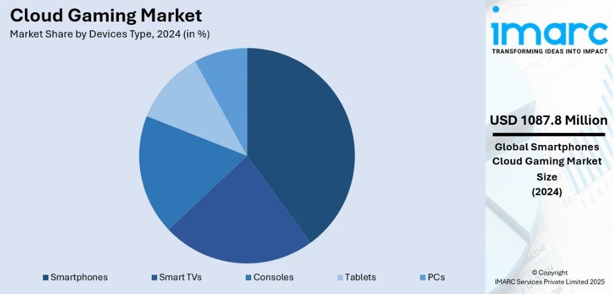

<h1>The Viability and Future of Cloud Gaming</h1>

<h2>Introduction</h2>

Cloud gaming, also known as game streaming, is a technology that allows users to play video games streamed from the cloud rather than relying on local hardware. This model enables gaming on a variety of devices, including smartphones, tablets, and smart TVs, without the need for high-end gaming consoles or PCs. By 2025, cloud gaming has become increasingly viable due to several technological advancements and market trends. This report examines the current state of cloud gaming, its technological foundations, market projections, and future potential, providing insights into how this technology is reshaping the gaming industry and expanding accessibility to high-quality gaming experiences.

<h2>Market Overview and Projections</h2>

<h3>Market Growth</h3>

The global cloud gaming market is projected to grow from $2.38 billion in 2022 to an estimated $8.17 billion by 2025. This substantial growth reflects a Compound Annual Growth Rate (CAGR) of approximately 50%, underscoring the increasing adoption and investment in cloud gaming technologies across the industry.

<h3>User Adoption</h3>

By 2025, the number of cloud gamers worldwide is expected to reach approximately 293 million. This represents a significant rise from previous years and highlights the expanding reach and appeal of cloud gaming among diverse audiences, from casual mobile gamers to dedicated console players seeking flexibility.

